# تطبيق Instagram Clone

تطبيق مشاركة الصور والمنشورات مطور باستخدام Flutter و Supabase، يحاكي الوظائف الأساسية لتطبيق Instagram.

## المميزات الرئيسية

### 🔐 المصادقة والحسابات
- تسجيل الدخول والخروج
- إنشاء حساب جديد
- تأكيد البريد الإلكتروني
- إدارة الملف الشخصي

### 📱 المنشورات والمحتوى
- إنشاء منشورات نصية
- رفع الصور مع النصوص
- عرض المنشورات في الصفحة الرئيسية
- نظام الإعجاب والتعليقات
- الرد على التعليقات

### 👥 التفاعل الاجتماعي
- متابعة المستخدمين الآخرين
- عرض ملفات المستخدمين
- نظام التعليقات المتقدم
- عرض منشورات المستخدم الشخصية

### ⚙️ الإعدادات والتخصيص
- الوضع الليلي والنهاري
- تغيير اللغة (العربية/الإنجليزية)
- إعدادات الخصوصية
- إعدادات الإشعارات

## لقطات الشاشة

### شاشة تسجيل الدخول


### شاشة إنشاء الحساب
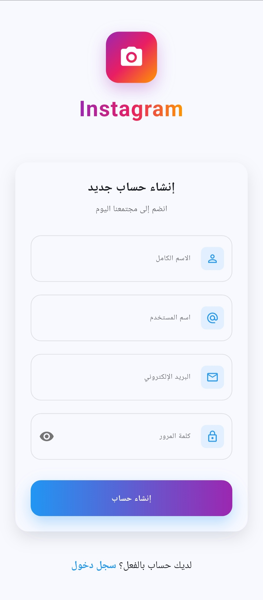

### تأكيد البريد الإلكتروني
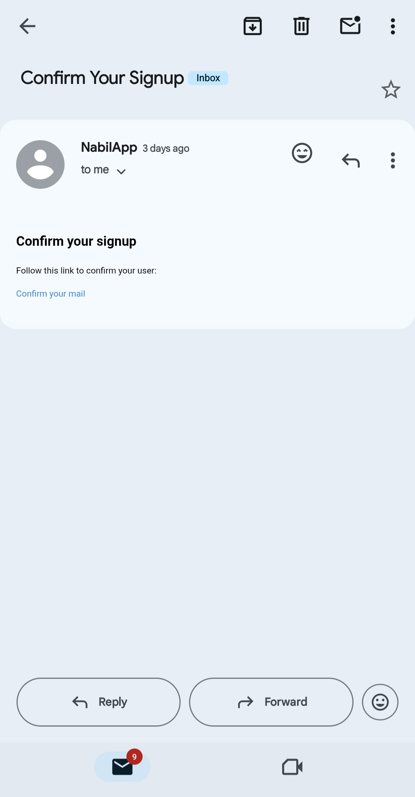

### عملية التحقق
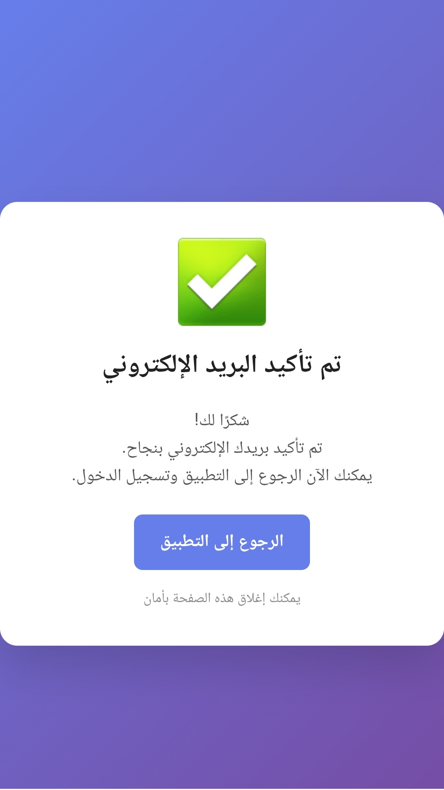

### الصفحة الرئيسية - المنشورات النصية
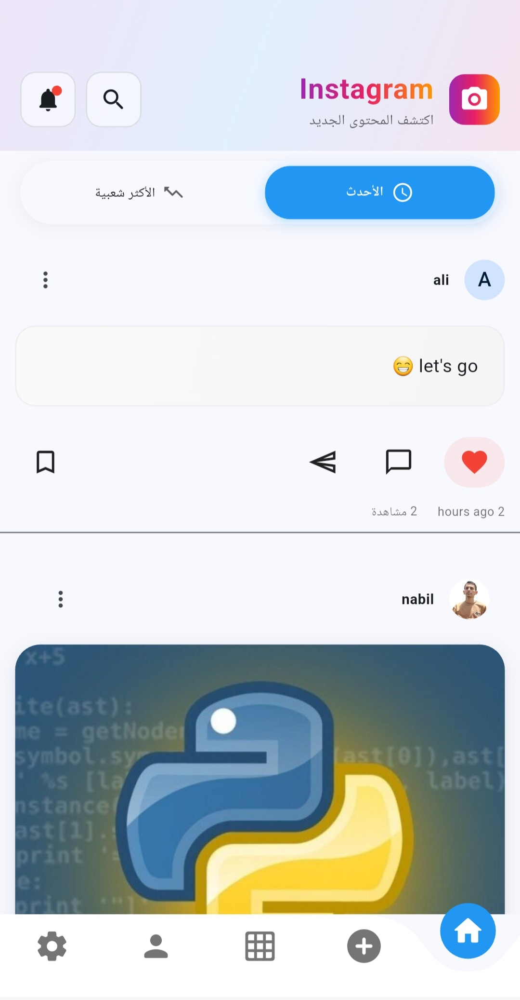

### المنشورات مع الصور
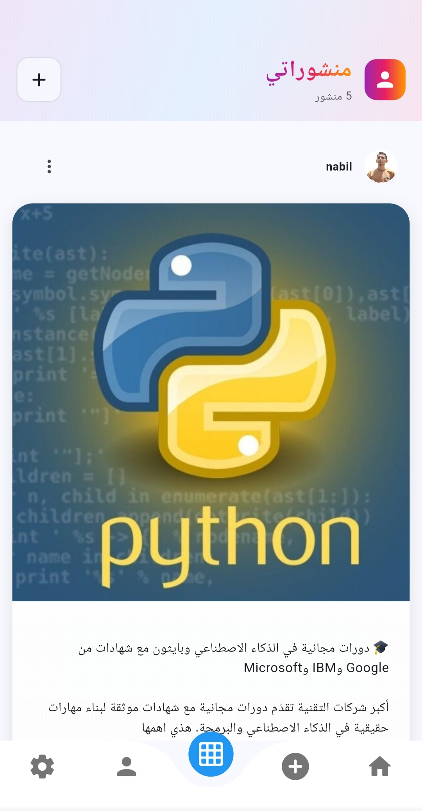

### شاشة إنشاء المنشورات
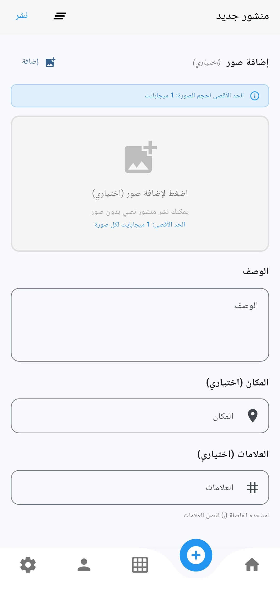

### شاشة التعليقات
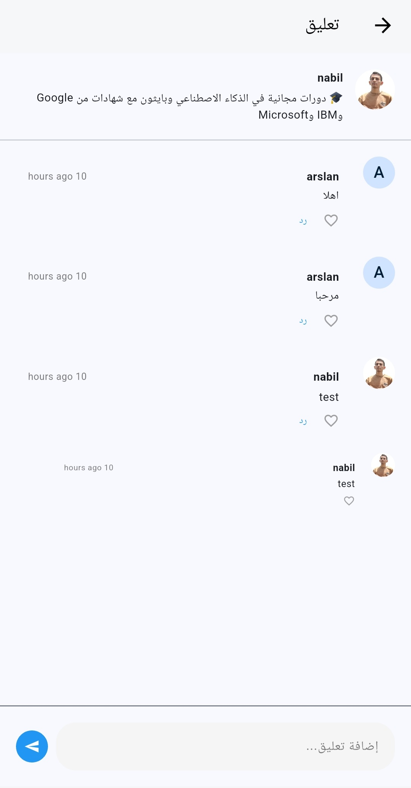

### تبويب الأكثر شعبية
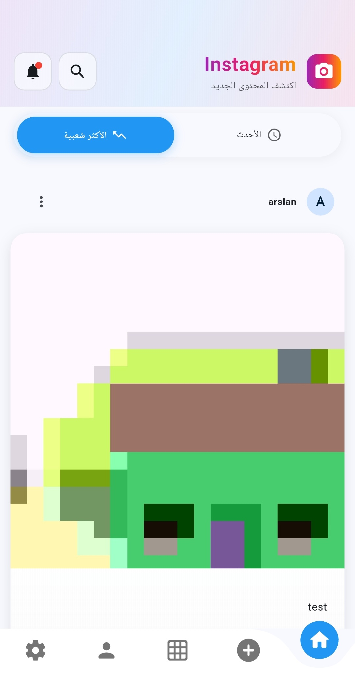

### شاشة تعديل الملف الشخصي
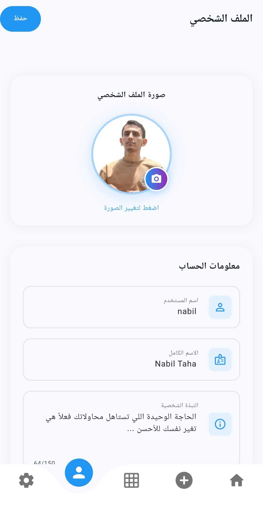

### شاشة الإعدادات
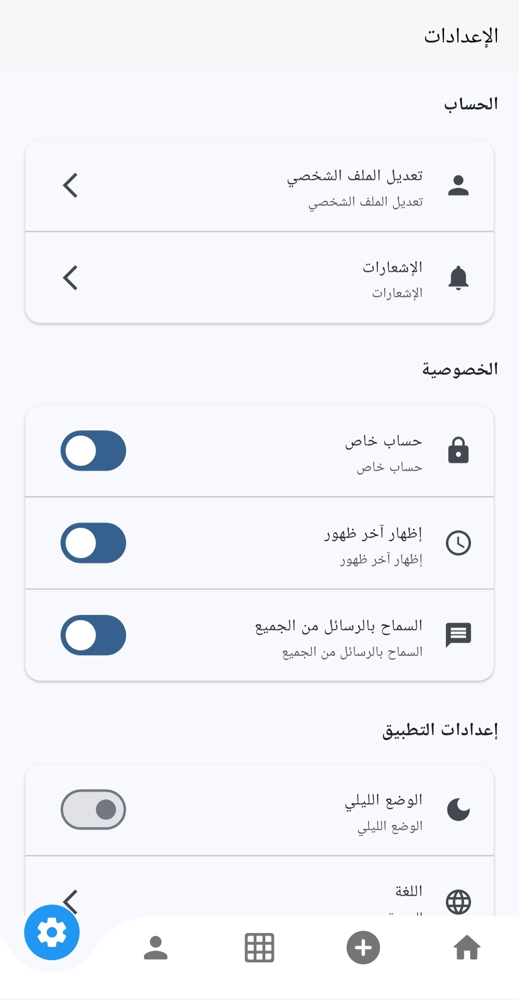

### الوضع الليلي
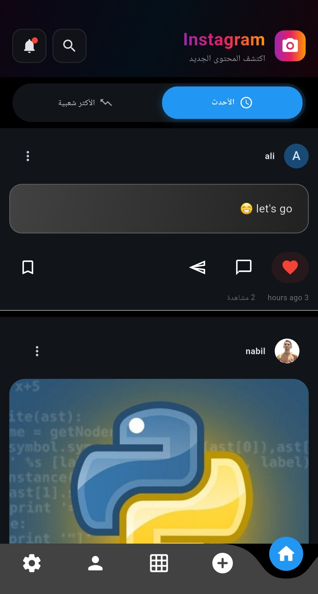

### رسالة عدم الاتصال
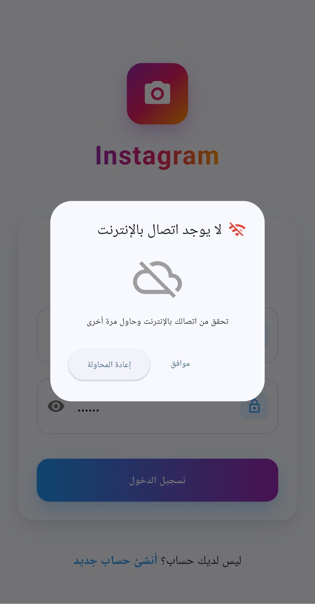

## التقنيات المستخدمة

### Frontend
- **Flutter**: إطار العمل الرئيسي لتطوير التطبيق
- **GetX**: إدارة الحالة والتنقل والتبعيات
- **Cached Network Image**: تحسين عرض الصور
- **Image Picker**: اختيار الصور من المعرض أو الكاميرا
- **Timeago**: عرض الأوقات النسبية

### Backend
- **Supabase**: قاعدة البيانات والمصادقة
- **PostgreSQL**: قاعدة البيانات الأساسية
- **Supabase Storage**: تخزين الصور والملفات

### الحزم الإضافية
- **Connectivity Plus**: مراقبة حالة الاتصال
- **Shared Preferences**: تخزين الإعدادات المحلية
- **Flutter Localizations**: دعم اللغات المتعددة

## متطلبات التشغيل

- Flutter SDK 3.0 أو أحدث
- Dart SDK 2.17 أو أحدث
- Android Studio أو VS Code
- حساب Supabase

## التثبيت والإعداد

### 1. استنساخ المشروع
```bash
git clone https://github.com/your-username/instagram-clone.git
cd instagram-clone
```

### 2. تثبيت التبعيات
```bash
flutter pub get
```

### 3. إعداد Supabase
1. إنشاء مشروع جديد في [Supabase](https://supabase.com)
2. نسخ URL و API Key
3. إنشاء ملف `lib/constants/app_constants.dart` وإضافة البيانات:

```dart
class AppConstants {
  static const String supabaseUrl = 'YOUR_SUPABASE_URL';
  static const String supabaseAnonKey = 'YOUR_SUPABASE_ANON_KEY';
  
  // أسماء الجداول
  static const String usersTable = 'users';
  static const String postsTable = 'posts';
  static const String commentsTable = 'comments';
  static const String likesTable = 'likes';
  static const String followersTable = 'followers';
}
```

### 4. إنشاء قاعدة البيانات
هناك ملفات في مجلد database يمكن الاستفادة منها

### 5. تشغيل التطبيق
```bash
flutter run
```

## هيكل المشروع

```
lib/
├── bindings/          # ربط التبعيات
├── constants/         # الثوابت والإعدادات
├── controllers/       # منطق التطبيق (GetX Controllers)
├── middleware/        # الوسطاء للتحقق من المصادقة
├── models/           # نماذج البيانات
├── routes/           # مسارات التنقل
├── services/         # خدمات التطبيق
├── translations/     # ملفات الترجمة
├── utils/           # الأدوات المساعدة
├── views/           # واجهات المستخدم
├── widgets/         # المكونات القابلة لإعادة الاستخدام
└── main.dart        # نقطة البداية
```